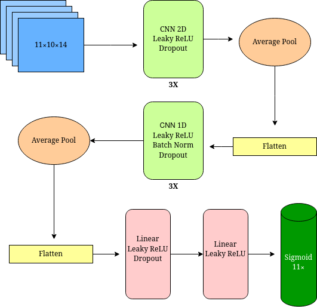

<h1 style="text-align: center;"> 🏈 NFL Big Data Bowl 2024 🏈</h1>

Here contains the sourcecode used for [my submission to the Kaggle NFL Big Data Bowl 2024](https://www.kaggle.com/code/timroy/nfl-big-data-bowl-2024). Using 9 weeks of frame-by-frame player sensor data (about 10 frames per second), I trained a deep convolutional network to predict the probabiliy of a defensive player making a tackle on the play, getting updated each frame.

## Quantifying Tackling Ability

The model was used to identify _Tackle Opportunities_ or _TOpps_. A player's _Tackle Efficiency_ or _TklEff_ is the ratio of total tackles (including assists) to _TOpps_.

{___TOppg,p___} $= \forall f \in F,\{i| P(x_i^{g,p,f} \ge 0.5) \cap (P(x_i^{g,p,f}) = max(P(x_j^{g,p,f}):j\in I) \}$

___TklEff___ is then simply: $ \large \frac{\sum Tackle_i}{\sum 1_{\{TOpp\}}(i)}  $

Player X is credited with a TOpp in a given play when both of the following conditions are met _in the same frame_:

1. Player X is predicted to make a tackle with at least 50% probabily
2. Player X has the highest probability of making the tackle out of all 11 players

The cumulative tackle probabilities at any given moment for all eleven defenders range from 0% to 200%. Additional details are in the submission.

Where

$g$ = game-ID
$p$ = Play-ID
$f$ = frame-ID
$F$ = set of frame-IDs for g,p
$x$ = tackle
$i$ = NFL-ID
$I$ = set of NFL-IDs active on play
$1_{\{TOpp\}}(i)$ is the indicator function for i in {TOpp}

# Model Details

There are actually 2 separate models with almost the same structure. A toucdhown probability model was trained to correectly account for the play outcome, however I needed this model to be "good enough" since the focus was on tackling. Hence I just used the same structure with substituting the final 11 X sigmoid layer and binary cross entropy loss with a single sigmoid. The target classes can be weighted by a single hyperparameter, which was chosen to achieve a desired balance of sensitivity and specificity.

A high-level diagram is below.

    

### Experimental Feature

I included an experimental feature that was not used in the submission, which is predicting the tackle coordinates (i.e. yardline and distance from boundary). For thie experimental feature, the same weights were used up to right before the first linear layer. Like the original model, 3 more layers are learned: 3 linear layers instead of 2 and a sigmoid. The final layer is a regression estimate for the 2 coordinates.

The regression layer performed well but to keep the submission focused, I decided to omit this component. The same model trains the shared weights and the independent weights after branching, with the loss function calculated as a weighted average between the classification and the regression components, with the weight as a supplied hyperparameter.

### Steps to recreate

1. Create a feature rich set of serialized files, one file for each play, containing the tensors for each frame (model inputs), targets, and meta data for a given play: [features.py](./src/features.py).

2. Create train/validation/test sets, using gameID as a grouping variable: [model_data.py](./src/model_data.py).

3. Tune hyperparameters: [model_tackle_hp_tune.ipynb](./src/model_tackle_hp_tune.ipynb) and [model_td_hp_tune.ipynb](./src/model_td_hp_tune.ipynb). Monitor the results using tensorboard: `tensorboard --logdir=./`

4. Train final model using: [model_tackle.ipynb](./src/model_tackle.ipynb) and [model_td.ipynb](./src/src/model_td.ipynb).

5. Run predictions to store tackle predictions to disk: [predict.py](./src/predict.py).